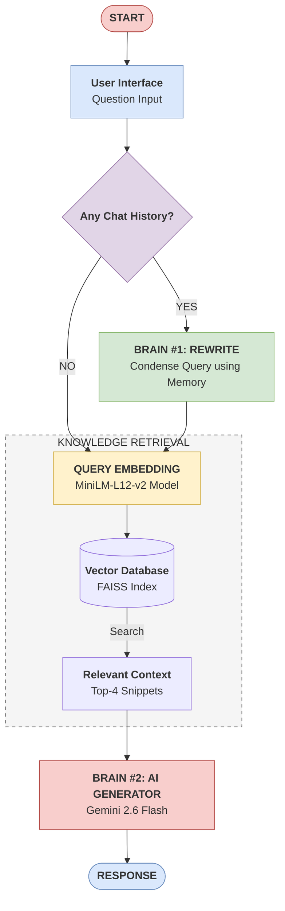

# 📈 Knowledge RAG Assistant

A robust, conversational Retrieval-Augmented Generation (RAG) system built with **LangChain**, **Gemini 2.6 Flash**, and **FAISS**. This assistant allows you to chat with any collection of documents, maintaining context across multiple turns with high-speed streaming results.

## 🏛️ System Architecture

This project follows a professional RAG pipeline, ensuring high accuracy and conversational awareness.



## 🚀 Key Features

- **Brain #1 (The Condenser)**: Automatically rewrites multi-turn questions into standalone search queries.
- **Smart Knowledge Search**: Uses `sentence-transformers/paraphrase-multilingual-MiniLM-L12-v2` for precise semantic retrieval.
- **Gemini 2.6 Flash**: Powered by the latest high-speed generative model for accurate, context-grounded answers.
- **Real-time Streaming**: Watch the response get typed out character-by-character for zero perceived latency.

## 🛠️ How to View/Edit the Design

The professional architectural design is available as a **Draw.io** XML file. 

1. Go to [app.diagrams.net](https://app.diagrams.net/).
2. Drag and drop the file `generic_rag_design.drawio` located in the artifacts directory.

---

### Getting Started

1. **Add Documents**: Place your `.pdf`, `.txt`, or `.md` files in the `/data` folder.
2. **Setup Env**: Add your `GOOGLE_API_KEY` to the `.env` file.
3. **Run UI**:
   ```bash
   streamlit run src/frontend/streamlit_app.py
   ```
