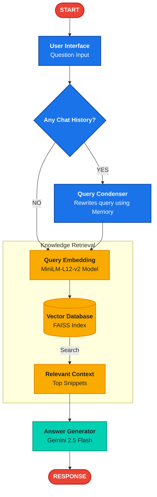

# 📈 Knowledge RAG Assistant

A robust, conversational Retrieval-Augmented Generation (RAG) system built with **LangChain**, **Gemini 2.5 Flash**, and **FAISS**. This assistant allows you to chat with any collection of documents, maintaining context across multiple turns with high-speed streaming results.

## 🏛️ System Architecture

This project follows a professional RAG pipeline, ensuring high accuracy and conversational awareness.



## 🚀 Key Features

- **Context-Aware Retrieval**: Automatically rewrites multi-turn questions to resolve pronouns and context.
- **Semantic Search**: Uses `paraphrase-multilingual-MiniLM-L12-v2` for high-precision local document matching.
- **Generative Intelligence**: Powered by `Gemini 2.5 Flash` for factual, grounded, and concise answers.
- **Real-time Streaming**: Instant feedback with character-by-character output generation.

## 🛠️ Getting Started

1. **Add Documents**: Place your `.pdf`, `.txt`, or `.md` files in the `/data` folder.
2. **Setup Env**: Add your `GOOGLE_API_KEY` to the `.env` file.
3. **Run UI**:
   ```bash
   streamlit run src/frontend/streamlit_app.py
   ```
